# 🌌 Parallel Mandelbrot Explorer

*An Interactive Journey into the Infinite Beauty of Fractals*

<div align="center">


**Explore the mesmerizing world of the Mandelbrot set with real-time parallel computation**

</div>

---

## 🎯 Overview

The Parallel Mandelbrot Explorer is a high-performance, interactive fractal viewer that brings the mathematical beauty of the Mandelbrot set to life. Built with C++ and powered by parallel computing, this application delivers smooth, real-time exploration of one of mathematics' most famous fractals.

## ✨ Key Features

### 🚀 **High-Performance Rendering**
- **Parallel Processing**: Leverages OpenMP for multi-core CPU acceleration
- **Real-time Interaction**: Smooth zooming and panning without lag
- **Optimized Algorithms**: Efficient Mandelbrot set computation

### 🎨 **Visual Excellence**
- **Multiple Color Palettes**: 
  - 🔥 Fire (Classic red-orange gradient)
  - ⚡ Electric (Vibrant cyan-blue)
  - 🌊 Ocean (Cool blue tones)
  - 🖤 Grayscale (Monochrome elegance)
  - 🎨 Classic (Traditional Mandelbrot coloring)

### 🎮 **Intuitive Controls**
- **Mouse & Keyboard Navigation**: Natural, responsive controls
- **Dynamic Zoom**: Explore from overview to microscopic detail
- **Live Parameter Adjustment**: Real-time visual feedback

## 🏗️ Architecture Overview

The application follows a modular architecture designed for performance and maintainability:

### **System Architecture**


### **Interactive Architecture Demo**


### **Computation Pipeline**

```mermaid
flowchart LR
    A[👤 User Input] --> B[🎮 Input Processing]
    B --> C[⚡ Parallel Computation<br/>OpenMP]
    C --> D[🎨 Color Mapping]
    D --> E[🖥️ Hardware Rendering]
    E --> F[📊 State Update]
    F --> G[🔄 Display Refresh]
    
    C --> H[🔀 CPU Core 1]
    C --> I[🔀 CPU Core 2]
    C --> J[🔀 CPU Core N]
    
    H --> D
    I --> D
    J --> D
    
    style A fill:#e1f5fe
    style C fill:#f3e5f5
    style D fill:#e8f5e8
    style E fill:#fff3e0
```



## 📸 Gallery

### Different Color Palettes

<div align="center">

| Fire Palette | Electric Palette | Ocean/Grayscale Palette |
|:------------:|:----------------:|:-----------------------:|
|  |  |  |
| *Classic red-orange gradient* | *Vibrant cyan-blue tones* | *Elegant monochrome* |

</div>

### Zoom Levels & Detail Views

<div align="center">

| Overview | Medium Zoom | Deep Zoom |
|:--------:|:-----------:|:---------:|
|  |  |  |
| *Full Mandelbrot set view* | *Exploring the boundary* | *Infinite fractal detail* |

</div>

> **Note**: The beauty of the Mandelbrot set lies in its infinite detail. Each zoom level reveals new intricate patterns and self-similar structures that continue indefinitely.

## 🛠️ Prerequisites

### **System Requirements**
- **OS**: Windows 10+, macOS 10.14+, or Linux (Ubuntu 18.04+)
- **CPU**: Multi-core processor recommended for optimal performance
- **RAM**: 4GB minimum, 8GB+ recommended
- **Graphics**: OpenGL 3.0+ compatible

### **Development Dependencies**
- **C++ Compiler**: C++17 or later
  - GCC 7+ / Clang 6+ / MSVC 2019+
- **Libraries**:
  - SDL2 (Simple DirectMedia Layer)
  - OpenMP (parallel processing)
- **Build System**: CMake 3.16+

## 🚀 Quick Start

### **1. Clone the Repository**
```bash
git clone https://github.com/yourusername/parallel-mandelbrot-explorer.git
cd parallel-mandelbrot-explorer
```

### **2. Install Dependencies**

#### **Ubuntu/Debian**
```bash
sudo apt update
sudo apt install libsdl2-dev libomp-dev cmake build-essential
```

#### **macOS** (with Homebrew)
```bash
brew install sdl2 libomp cmake
```

#### **Windows** (with vcpkg)
```bash
vcpkg install sdl2 openmp
```

### **3. Build the Project**
```bash
mkdir build && cd build
cmake ..
make -j$(nproc)  # Linux/macOS
# or
cmake --build . --config Release  # Windows
```

### **4. Run the Explorer**
```bash
./ParallelMandelbrotExplorer
```

## 🎮 Controls Reference

### **Navigation**
| Key/Action | Function |
|------------|----------|
| `↑↓←→` | Pan view in respective direction |
| `Mouse Wheel` | Zoom in/out at cursor position |
| `+/-` | Zoom in/out at center |

### **Visualization**
| Key | Function |
|-----|----------|
| `C` | Cycle through color palettes |
| `R` | Reset view to default position |
| `H` | Show/hide help overlay |

### **Application**
| Key | Function |
|-----|----------|
| `ESC` / `Q` | Exit application |
| `F` | Toggle fullscreen mode |
| `I` | Show iteration count info |

## ⚙️ Configuration

### **Runtime Parameters**
The application supports several customizable parameters:

```cpp
// Rendering Quality
const int MAX_ITERATIONS = 1000;    // Higher = more detail, slower
const int SCREEN_WIDTH = 1200;      // Window width
const int SCREEN_HEIGHT = 800;      // Window height

// Navigation Sensitivity
const double ZOOM_FACTOR = 1.5;     // Zoom speed multiplier
const double PAN_SPEED = 0.1;       // Pan sensitivity
```

### **Color Palette Customization**
Add custom color palettes by modifying the `ColorPalette` class:

```cpp
// Example: Sunset palette
std::vector<SDL_Color> sunsetColors = {
    {255, 94, 77},   // Coral
    {255, 154, 0},   // Orange
    {255, 206, 84},  // Yellow
    {237, 117, 97}   // Pink
};
```

## 🔬 Technical Deep Dive

### **Mandelbrot Set Mathematics**
The Mandelbrot set is defined as the set of complex numbers `c` for which the iterative equation:

```
z(n+1) = z(n)² + c
```

remains bounded when starting with `z(0) = 0`.

### **Parallel Optimization**
The application uses OpenMP to parallelize the pixel computation:

```cpp
#pragma omp parallel for schedule(dynamic)
for (int y = 0; y < height; ++y) {
    for (int x = 0; x < width; ++x) {
        // Compute Mandelbrot iteration for pixel (x,y)
        int iterations = computeMandelbrot(x, y);
        pixels[y * width + x] = mapColor(iterations);
    }
}
```

### **Performance Benchmarks**
| CPU Cores | Resolution | FPS (avg) | Zoom Responsiveness |
|-----------|------------|-----------|-------------------|
| 2 cores   | 800x600    | 30 FPS    | Good             |
| 4 cores   | 1200x800   | 45 FPS    | Excellent        |
| 8 cores   | 1920x1080  | 60 FPS    | Outstanding      |

## 🤝 Contributing

We welcome contributions! Here's how you can help:

### **Areas for Contribution**
- 🎨 New color palettes
- 🚀 Performance optimizations
- 🖥️ GPU acceleration (CUDA/OpenCL)
- 📱 Mobile platform support
- 🎵 Audio visualization features

### **Development Workflow**
1. Fork the repository
2. Create a feature branch (`git checkout -b feature/amazing-feature`)
3. Commit your changes (`git commit -m 'Add amazing feature'`)
4. Push to branch (`git push origin feature/amazing-feature`)
5. Open a Pull Request

## 🙏 Acknowledgments

- **SDL2 Team** for the excellent multimedia library
- **OpenMP** contributors for parallel processing capabilities
- **Benoit Mandelbrot** for discovering this beautiful mathematical object
- **Mathematical Community** for continued fractal research


<div align="center">

**Made with ❤️ for the mathematical community**

</div>
